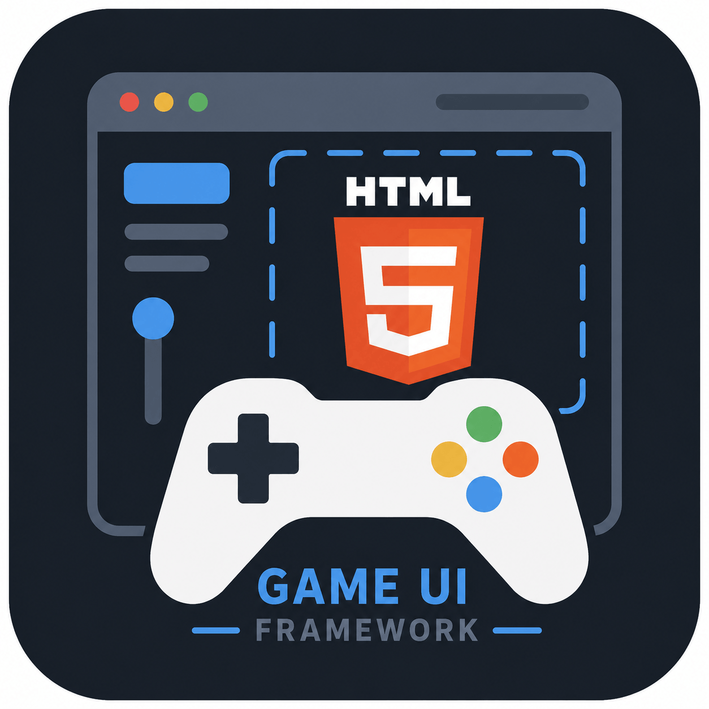

<!--
---
title: "html5-game-ui-framework"
description: "A renderer-agnostic browser game UI framework whose reference application is also its conformance surface"
author: "VintageDon (https://github.com/vintagedon/)"
date: "2026-08-02"
version: "0.3"
status: "Active"
tags:
  - type: project-root
  - domain: foundations
  - tech: [css, javascript, html, svg, playwright]
related_documents:
  - "[Project Charter](docs/project-charter.md)"
  - "[Agent Instructions](AGENTS.md)"
  - "[Tagging Strategy](docs/documentation-standards/tagging-strategy.md)"
---
-->

<div align="center">



# html5-game-ui-framework

**A browser game UI framework with no runtime image assets.**

HUD, menus, inventory, dialogue, and settings for a browser game, generated entirely from CSS and inline SVG. Its reference page is also its test suite.

[](#architecture)
[](#architecture)
[](#overview)
[](#overview)
[](#overview)
[](#getting-started)
[](LICENSE)

[Overview](#overview) · [Architecture](#architecture) · [Status](#project-status) · [Structure](#repository-structure) · [Getting Started](#getting-started) · [Where This Runs](#where-this-runs) · [Charter](docs/project-charter.md) · [License](#license)

</div>

---

This is the UI layer for a browser game: the HUD, menus, inventory, dialogue, settings, save slots, and the chrome around the playfield. It is built on DOM and CSS and sits over whatever draws the game, so a Canvas 2D arcade shooter, a DOM-routed deckbuilder, and a WebGPU demo all get the same interface layer without the framework knowing which is underneath.

---

## Overview

### What it solves

Game UI kits ship pictures of UI. Buy one and you get PNGs at three fixed sizes, four state variants of every button, and text baked into the artwork, all under a licence that governs how you may redistribute it. Recolouring means re-exporting. Scaling means re-exporting. A frosted panel cannot blur the gameplay behind it, because a raster cannot blur what it does not contain.

The second problem is slower and worse. A UI kit is easy to start and hard to keep honest. Components accumulate, themes fork, a specimen page shows the happy path, and six months later the documentation describes something the code no longer does.

### How it works

**No runtime image assets.** Every frame, fill, texture, ornament, glow, and icon the framework renders is generated from CSS and inline SVG. That makes the whole kit text: diffable, greppable, reviewable in a pull request. Theme switching is instant because there is nothing to load, `backdrop-filter` composites correctly over live gameplay, and one source renders crisply at any resolution. Fantasy parchment and filigree come from SVG filters and generated gradients rather than a folder of WebP files.

The rule covers what the framework and its themes ship to a running game. Repository documentation art, such as the logo in this README, is outside it, and the published metric counts framework paths only.

**The documentation is the test suite.** Every component declares its dependency level, required tokens, theme and viewport coverage, initial state, scripted interactions, and named capture checkpoints. The reference application renders from that declaration, and Playwright reads the same declaration to drive the interactions and compare captures against approved goldens. A module that reaches for another module renders as a visible failure on the page rather than only as a red test run. The metrics header is computed from the repository, so the headline claims are either true at build time or visibly false.

**Requirements come from artifacts that exist.** The predecessor framework contributes thirteen shipped component families, several commercial template packs contribute requirement lists and technique, and real games supply the integration pressure. Nothing enters the core because it seemed like a good idea.

---

## Project Status

| Area | Status | Description |
|------|--------|-------------|
| Charter | ✅ Complete | Scope, architecture, and acceptance criteria approved at v1.5 |
| Repository hydration | 🔄 In Progress | Standards, agent scaffolding, and the documentation pass landed; git initialization pending |
| Foundations | ⬜ Planned | Token contract, cascade layers, theme mechanism, four themes (modern, arcade, sci-fi, fantasy) |
| Zero-raster spike | ⬜ Planned | Dark fantasy theme rendered with no image files |
| Harness | ⬜ Planned | Scenario registry, reference application, Playwright runner, goldens, metrics |
| Core primitives | ⬜ Planned | Added only under consumer pressure |
| Modules | ⬜ Planned | Composed from core; no module-to-module dependency |
| First consumer | ⬜ Planned | Rogue Cellar integration, UI layer only |
| Published demo | ⬜ Planned | One original game, after the framework is proven |

---

## Architecture

Four layers with dependency flowing in one direction. Foundations are designed deliberately because their names are public API. Core and Modules are discovered under consumer pressure rather than decreed in advance.

| Component | Implementation | Purpose |
|-----------|----------------|---------|
| Foundations | CSS custom properties, `@layer`, `color-mix()` | Token tiers, typography roles, spacing, motion, focus and state rules, theme interface, canvas host |
| Core | CSS and ESM, `:where()`-wrapped | Domain-neutral primitives usable by more than one consumer without translation |
| Modules | Compositions of Core | Recognizable game patterns: HUD strip, event log, inventory, dialogue, save slots, settings |
| Consumers | Integration recipes | The per-game boundary between framework and game |
| Harness | Scenario registry, Playwright | Renders the reference application and drives the regression suite from one declaration |

Full architecture, acceptance criteria, and the harvest corpus inventory are in the [project charter](docs/project-charter.md).

---

## Repository Structure

```markdown
html5-game-ui-framework/
├── assets/                    # Repository logo and documentation imagery
├── docs/                      # Documentation
│   ├── documentation-standards/  # Template library and guidelines
│   └── project-charter.md     # Frozen scope and architecture
├── internal-files/            # Ideation and source materials (gitignored)
├── recycle-bin/               # Agent trash can (gitignored)
├── reference-files-assets/    # Third-party art packs (gitignored, never redistributed)
├── reference-files-games/     # Third-party game templates (gitignored)
├── reference-files-ui/        # Third-party UI packs (gitignored)
├── staging/                   # Pre-commit staging area (gitignored)
├── .gitignore
├── .markdownlint.json         # Markdown lint configuration (tracked; project config)
├── cspell.json                # Spell-check dictionary (tracked; project config)
├── AGENTS.md                  # Agent context loading and constraints
├── CLAUDE.md                  # Pointer to AGENTS.md
├── CODE_OF_CONDUCT.md
├── CONTRIBUTING.md
├── LICENSE                    # MIT, covering code
├── LICENSE-DATA               # CC-BY-4.0, covering documentation and content
├── SECURITY.md
└── README.md                  # This file
```

The spec queue and work logs are shared estate directories at `/opt/agents/repos/spec/` and `/opt/agents/repos/work-logs/`, peers of this repository rather than a parent workspace. Several agent estates work this repository through one lifecycle, so the queue and the registry are held in common.

The three `reference-files-*` directories hold licensed third-party packs used as requirement and technique reference. They are excluded from version control. Their licences permit use inside finished projects and prohibit redistribution as templates, asset packs, or component libraries.

---

## Getting Started

The framework has no build step and no external runtime dependency. Development tooling requires Node for the metrics generator and Playwright for the scenario runner.

```bash
git clone https://github.com/vintagedon/html5-game-ui-framework
cd html5-game-ui-framework

# Development tooling (once the harness lands)
npm install
npx playwright install chromium
```

The project is in the foundations phase. There is no consumable artifact yet.

---

## Where This Runs

The framework is a UI layer for browser games. It has no opinion about game logic, rendering engine, or hosting.

The reference application is served as a local preview on ML01 nginx at `gameui.donfather.site`, resolved by hosts file and reachable only inside the estate. That is the framework's only deploy; the public artifact is this repository. Games that consume the framework deploy wherever they deploy, which for this estate is Azure Static Web Apps, and none of that is tracked here.

---

## License

- **Code**: [MIT License](LICENSE)
- **Data/Content**: [CC-BY-4.0](LICENSE-DATA)

Third-party reference material held locally under `reference-files-*` is licensed separately by its respective vendors and is not covered by this repository's license. It is excluded from version control and is not redistributed.

---

Last Updated: August 2, 2026 | Status: Foundations
